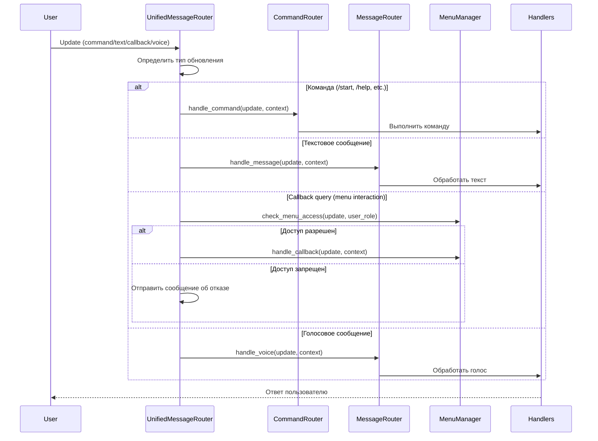
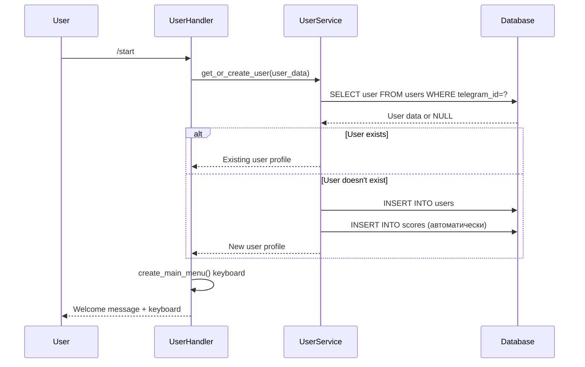
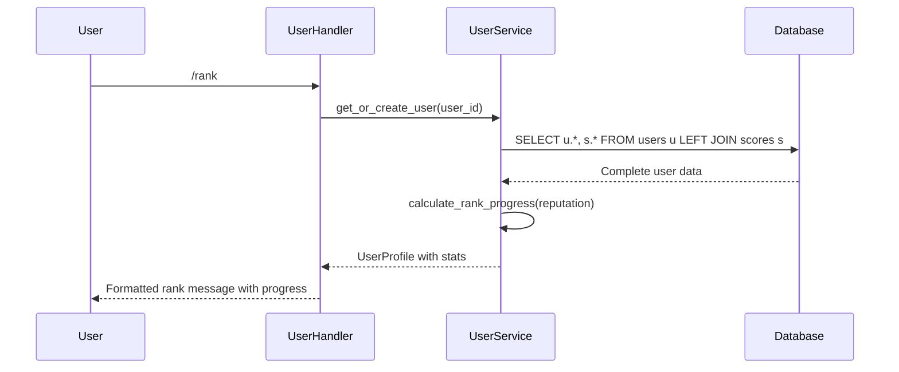
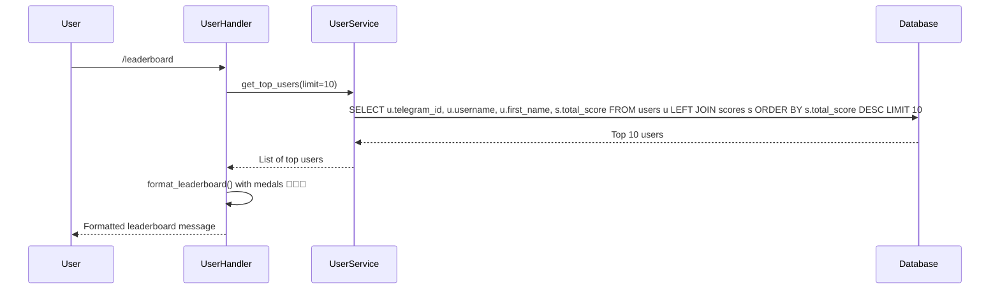

# 📋 Подробная документация архитектуры телеграм-бота

## Содержание
- [Обзор проекта](#-обзор-проекта)
- [Структура проекта](#-структура-проекта)
- [Архитектурные компоненты](#-архитектурные-компоненты)
- [Потоки данных](#-потоки-данных)
- [Система ролей и прав](#-система-ролей-и-прав)
- [Система тестирования](#-система-тестирования)
- [Зависимости и интеграции](#-зависимости-и-интеграции)
- [Масштабируемость и развитие](#-масштабируемость-и-развитие)

## 🎯 Обзор проекта

Telegram бот представляет собой комплексную систему управления сообществом с широким набором функций:

### Основные возможности:
- **Управление пользователями**: Регистрация, ранги, статистика активности, достижения
- **Игровые функции**: Камень-ножницы-бумага, крестики-нолики, викторины, морской бой, 2048, тетрис, змейка
- **Система модерации**: Предупреждения, муты, баны, фильтрация нецензурной лексики
- **Платежная система**: Интеграция с Stripe, YooKassa, СБП для донатов
- **Планировщик контента**: Отложенная публикация постов и изображений
- **Система триггеров**: Автоматические ответы на ключевые слова
- **Мониторинг и алерты**: Метрики производительности, логирование ошибок, уведомления администраторов
- **Многоуровневая система ролей**: Пользователи, модераторы, администраторы с различными правами доступа

### Архитектурные принципы:
- **Модульность**: Разделение на независимые компоненты (ядро, сервисы, обработчики, репозитории)
- **Асинхронность**: Все операции ввода-вывода реализованы асинхронно для высокой производительности
- **Безопасность**: Валидация данных, защита от SQL-инъекций, безопасная обработка платежей
- **Расширяемость**: Легкое добавление новых команд, игр, платежных провайдеров
- **Тестируемость**: Комплексная система unit и integration тестов

## 🏗 Структура проекта

```
telegram_bot/
├── core/                          # Ядро приложения
│   ├── application.py             # Главный класс Application - точка входа
│   ├── config.py                  # Управление конфигурацией
│   ├── exceptions.py              # Кастомные исключения
│   ├── unified_router.py          # Объединенный маршрутизатор сообщений
│   ├── command_router.py          # Маршрутизатор команд
│   ├── message_router.py          # Маршрутизатор типов сообщений
│   ├── menu_manager.py            # Менеджер меню
│   ├── permissions.py             # Система прав доступа
│   ├── middleware.py              # Промежуточное ПО
│   ├── monitoring.py              # Метрики и мониторинг
│   ├── alerts.py                  # Система алертов
│   ├── payment_models.py          # Модели платежей
│   ├── payment_security.py        # Безопасность платежей
│   └── payment_exceptions.py      # Исключения платежей
├── database/                      # Слой базы данных
│   ├── models.py                  # Модели данных (User, Score, Payment, etc.)
│   ├── repository.py              # Репозитории данных
│   └── payment_repository.py      # Репозиторий платежей
├── services/                      # Бизнес-логика
│   ├── user_service.py            # Сервис управления пользователями
│   ├── game_service.py            # Игровая логика и сессии
│   ├── moderation_service.py      # Сервис модерации
│   ├── donation_service.py        # Сервис платежей и донатов
│   ├── notification_service.py    # Сервис уведомлений
│   ├── role_service.py            # Сервис управления ролями
│   ├── trigger_service.py         # Сервис триггеров
│   └── welcome_service.py         # Сервис приветствий
├── handlers/                      # Обработчики команд
│   ├── base_handler.py            # Базовый класс обработчиков
│   ├── user_handlers.py           # Команды пользователей (/start, /help, /rank)
│   ├── game_handlers.py           # Игровые команды
│   ├── admin_handlers.py          # Админские команды
│   ├── moderation_handlers.py     # Команды модерации
│   └── payment_handler.py         # Обработчики платежей
├── tests/                         # Система тестирования
│   ├── test_core/                 # Тесты ядра
│   ├── test_services/             # Тесты сервисов
│   ├── test_handlers/             # Тесты обработчиков
│   ├── test_database/             # Тесты базы данных
│   ├── test_integration/          # Интеграционные тесты
│   └── test_performance/          # Тесты производительности
├── utils/                         # Утилиты
│   ├── formatters.py              # Форматирование сообщений и клавиатур
│   ├── validators.py              # Валидация данных
│   └── helpers.py                 # Вспомогательные функции
├── config/                        # Конфигурационные файлы
├── pictures/                      # Статические ресурсы
├── scheduler.py                   # Планировщик постов
├── run.py                         # Точка входа приложения
└── requirements.txt               # Зависимости Python
```

## 🔄 Потоки данных

### Новая система маршрутизации (Unified Router):



### Fallback механизмы:
- **Graceful degradation**: Если unified_router не инициализирован, используется старая система
- **Error handling**: Все ошибки в новой системе логируются, но не прерывают выполнение
- **Message editing fallback**: При неудаче редактирования сообщения отправляется новое

### Команда `/start`:


### Команда `/rank`:


### Команда `/leaderboard`:


## 🛡️ Система ролей и прав

### Иерархия ролей пользователей:

```
UserRole.ADMIN (наивысший приоритет)
├── VIEW_ALL_STATS      # Просмотр всей статистики
├── MANAGE_USERS        # Управление пользователями
├── MANAGE_MODERATORS   # Управление модераторами
├── SYSTEM_CONTROL      # Контроль системы
└── FULL_ACCESS         # Полный доступ

UserRole.MODERATOR
├── WARN_USERS          # Предупреждение пользователей
├── MUTE_USERS          # Мут пользователей
├── BAN_USERS           # Бан пользователей
├── VIEW_MOD_STATS      # Просмотр статистики модерации
└── MANAGE_TRIGGERS     # Управление триггерами

UserRole.USER (базовый уровень)
├── PLAY_GAMES          # Игра в игры
├── VIEW_RANK           # Просмотр ранга
├── DONATE              # Совершение донатов
├── SEND_VOICE          # Отправка голосовых сообщений
└── USE_COMMANDS        # Использование команд
```

### Permission Manager:

```python
class PermissionManager:
    def __init__(self):
        self.role_permissions = self._initialize_role_permissions()

    def has_permission(self, user_role: UserRole, permission: Permission) -> bool:
        """Проверяет, имеет ли роль указанное разрешение"""
        role_perms = self.get_role_permissions(user_role)
        return permission in role_perms

    def get_user_role_from_config(self, user_id: int, config) -> UserRole:
        """Определяет роль пользователя из конфигурации"""
        if user_id in config.admin_user_ids:
            return UserRole.ADMIN
        # Проверка модераторов...
        return UserRole.USER

    def can_execute_command(self, user_role: UserRole, command: str) -> bool:
        """Проверяет возможность выполнения команды для роли"""
        required_perm = self.get_required_permissions_for_command(command)
        return all(self.has_permission(user_role, perm) for perm in required_perm)
```

### Управление доступом к меню:

```python
class ContextMenuManager:
    def get_menu_for_user(self, menu_id: str, user_role: UserRole) -> InlineKeyboardMarkup:
        """Возвращает меню, доступное для роли пользователя"""
        if not self.is_menu_available(menu_id, user_role):
            raise PermissionError(f"Меню {menu_id} недоступно для роли {user_role}")

        menu_config = self.menus[menu_id]
        return menu_config.builder(user_role, **context)

    def is_menu_available(self, menu_id: str, user_role: UserRole) -> bool:
        """Проверяет доступность меню для роли"""
        if menu_id not in self.menus:
            return False
        required_role = self.menus[menu_id].required_role
        return self._has_required_role(user_role, required_role)
```

## 🧪 Система тестирования

### Архитектура тестирования:

```
tests/
├── conftest.py              # Общие фикстуры и настройки
├── test_core/              # Тесты ядра системы
│   ├── test_unified_router.py
│   ├── test_permissions.py
│   ├── test_message_router.py
│   └── test_menu_manager.py
├── test_services/          # Тесты бизнес-логики
│   ├── test_user_service.py
│   ├── test_game_service.py
│   ├── test_moderation_service.py
│   └── test_donation_service.py
├── test_handlers/          # Тесты обработчиков
│   ├── test_user_handlers.py
│   ├── test_admin_handlers.py
│   └── test_game_handlers.py
├── test_database/          # Тесты репозиториев
│   ├── test_repository.py
│   └── test_payment_repository.py
├── test_integration/       # Интеграционные тесты
│   ├── test_full_flow.py
│   ├── test_user_commands_integration.py
│   ├── test_payments_integration.py
│   └── test_moderation_integration.py
└── test_performance/       # Тесты производительности
    └── test_critical_functions.py
```

### Типы тестов:

#### Unit тесты:
- **Тестирование отдельных функций**: Валидаторы, утилиты, модели
- **Мокирование зависимостей**: Использование pytest-mock для изоляции
- **Тестирование исключений**: Проверка корректной обработки ошибок

#### Integration тесты:
- **Сквозное тестирование**: Полные сценарии использования (start → rank → leaderboard)
- **Тестирование БД**: Валидация запросов и транзакций
- **API интеграции**: Тестирование платежных провайдеров с моками

#### Performance тесты:
- **Тестирование критических функций**: Время выполнения ключевых операций
- **Нагрузочное тестирование**: Многопользовательские сценарии
- **Memory profiling**: Анализ использования памяти

### Инструменты тестирования:
- **pytest**: Основной фреймворк тестирования
- **pytest-asyncio**: Поддержка асинхронных тестов
- **pytest-mock**: Мокирование и стабы
- **coverage**: Измерение покрытия кода
- **faker**: Генерация тестовых данных

### Пример теста:

```python
class TestUserService:
    @pytest.mark.asyncio
    async def test_get_or_create_user_new_user(self, user_service, mock_repo):
        # Arrange
        user_data = {'telegram_id': 12345, 'username': 'testuser'}
        mock_repo.get_by_id.return_value = None
        mock_repo.create_user.return_value = {'id': 1, **user_data}

        # Act
        profile = await user_service.get_or_create_user(**user_data)

        # Assert
        assert profile.telegram_id == 12345
        assert profile.username == 'testuser'
        mock_repo.create_user.assert_called_once()
```

## 🔗 Зависимости и интеграции

### Внешние сервисы:

#### Платежные провайдеры:
- **Stripe**: Международные платежи, поддержка карт и цифровых кошельков
- **YooKassa**: Российский платежный агрегатор
- **СБП (Система Быстрых Платежей)**: Быстрые переводы по номеру телефона

#### Webhook обработка:
```python
class WebhookHandler:
    async def handle_stripe_webhook(self, request: Request) -> Response:
        # Валидация подписи Stripe
        signature = request.headers.get('Stripe-Signature')
        payload = await request.get_data()

        if not PaymentSecurity.validate_stripe_signature(payload, signature, secret):
            return Response(status=400, text="Invalid signature")

        # Обработка события платежа
        event = json.loads(payload)
        await self.donation_service.process_payment_webhook('stripe', event)
        return Response(status=200)
```

#### Мониторинг и алерты:
- **Sentry**: Отслеживание ошибок и производительности
- **Prometheus**: Сбор метрик и мониторинг
- **Grafana**: Визуализация метрик и алертов

### Алерты системы:

```python
class AlertManager:
    async def check_alerts(self):
        await self._check_error_rate_alert()
        await self._check_bot_status_alert()
        await self._check_response_time_alert()
        await self._check_database_alert()

    async def _check_error_rate_alert(self):
        error_count = self._get_error_count_last_minute()
        if error_count > self.config.error_rate_threshold:
            await self._trigger_alert(
                'high_error_rate',
                f'Высокий уровень ошибок: {error_count} за последнюю минуту'
            )
```

### Конфигурация зависимостей:

```python
@dataclass
class APIKeys:
    telegram_token: str
    stripe_secret_key: str
    stripe_webhook_secret: str
    yookassa_shop_id: str
    yookassa_secret_key: str
    sbp_api_key: str
    sentry_dsn: Optional[str] = None
    prometheus_url: Optional[str] = None
```

## 📈 Масштабируемость и развитие

### Горизонтальная масштабируемость:

#### Разделение базы данных:
- **Шардинг по пользователям**: Распределение нагрузки по нескольким серверам БД
- **Read replicas**: Отдельные серверы для чтения, основной для записи
- **Кеширование**: Redis для горячих данных (ранги, статистика)

#### Асинхронная обработка:
- **Очереди задач**: Celery для тяжелых операций (рассылки, аналитика)
- **WebSocket соединения**: Для real-time обновлений (лидерборды, статусы игр)
- **Микросервисная архитектура**: Разделение на независимые сервисы

### Вертикальная масштабируемость:

#### Оптимизация производительности:
- **Database indexes**: На часто запрашиваемые поля (telegram_id, user_id, created_at)
- **Query optimization**: Использование JOIN, подзапросов, материализованных представлений
- **Connection pooling**: Переиспользование соединений к БД

#### Мониторинг и профилирование:
- **APM (Application Performance Monitoring)**: Отслеживание узких мест
- **Memory profiling**: Анализ утечек памяти
- **CPU profiling**: Оптимизация вычислительно сложных операций

### План развития:

#### Краткосрочные цели (3-6 месяцев):
- **Расширение платежных систем**: Добавление новых провайдеров (PayPal, криптовалюта)
- **Расширенная аналитика**: Детальная статистика использования, cohort analysis
- **Многоязычность**: Поддержка нескольких языков интерфейса

#### Среднесрочные цели (6-12 месяцев):
- **Мобильное приложение**: Компаньон для управления ботом
- **AI интеграции**: Умные ответы, автоматическая модерация
- **Расширенные игры**: Турниры, рейтинги, социальные функции

#### Долгосрочные цели (1-2 года):
- **Платформенное решение**: White-label версия для других сообществ
- **API для разработчиков**: Возможность создания кастомных интеграций
- **Машинное обучение**: Персонализация контента, предиктивная аналитика

### Метрики успеха:
- **Производительность**: <500ms среднее время ответа
- **Надежность**: 99.9% uptime, <1% ошибок на запрос
- **Масштабируемость**: Поддержка 100k+ активных пользователей
- **Пользовательский опыт**: Высокие рейтинги, активное сообщество

Эта архитектура обеспечивает стабильную основу для роста и развития проекта, с возможностью постепенного расширения функциональности и увеличения нагрузки.

## 🗄 Обращения к базе данных

### Структура базы данных:
```sql
-- Таблица пользователей
CREATE TABLE users (
    id INTEGER PRIMARY KEY AUTOINCREMENT,
    telegram_id INTEGER UNIQUE NOT NULL,
    username TEXT,
    first_name TEXT,
    last_name TEXT,
    joined_date DATETIME DEFAULT CURRENT_TIMESTAMP,
    last_activity DATETIME DEFAULT CURRENT_TIMESTAMP,
    reputation INTEGER DEFAULT 0,
    rank TEXT DEFAULT 'Новичок',
    warnings INTEGER DEFAULT 0,
    is_active BOOLEAN DEFAULT 1
);

-- Таблица очков (связана с users)
CREATE TABLE scores (
    id INTEGER PRIMARY KEY AUTOINCREMENT,
    user_id INTEGER UNIQUE NOT NULL,
    total_score INTEGER DEFAULT 0,
    message_count INTEGER DEFAULT 0,
    game_wins INTEGER DEFAULT 0,
    donations_total REAL DEFAULT 0.0,
    last_updated DATETIME DEFAULT CURRENT_TIMESTAMP,
    FOREIGN KEY (user_id) REFERENCES users(id)
);
```

### Паттерн Repository:
```python
class UserRepository(BaseRepository):
    def get_by_id(self, user_id: int) -> Optional[Dict]:
        query = """
            SELECT u.*, s.total_score, s.message_count, s.game_wins
            FROM users u
            LEFT JOIN scores s ON u.id = s.user_id
            WHERE u.telegram_id = ?
        """
        return self._fetch_one(query, (user_id,))

    def update_activity(self, telegram_id: int, chat_id: int) -> Dict:
        # Атомарное обновление активности и статистики
        with self._get_connection() as conn:
            cursor = conn.cursor()
            cursor.execute("UPDATE users SET last_activity = ? WHERE telegram_id = ?",
                         (datetime.now(), telegram_id))
            cursor.execute("""
                UPDATE scores
                SET message_count = message_count + 1, last_updated = ?
                WHERE user_id = (SELECT id FROM users WHERE telegram_id = ?)
            """, (datetime.now(), telegram_id))
```

## 🔧 Детальная архитектура компонентов

### Application (Главный контроллер):
```python
class Application:
    def __init__(self, config_path: str = None):
        self.config = Config(config_path)           # Загрузка конфигурации
        self.user_repo = UserRepository(db_url)     # Репозиторий пользователей
        self.score_repo = ScoreRepository(db_url)   # Репозиторий очков
        self.user_service = UserService(user_repo, score_repo)  # Бизнес-логика
        self.handlers = self._initialize_handlers() # Обработчики команд
        self.telegram_app = TelegramApplication.builder().token(token).build()

        # Инициализация новой системы маршрутизации
        self._initialize_unified_router()
        self._setup_unified_router()

    def run(self):
        self._validate_startup_config()  # Проверка конфигурации
        self.telegram_app.run_polling()  # Запуск бота

    def _initialize_unified_router(self):
        """Инициализация новой системы маршрутизации с graceful degradation"""
        try:
            # Создание компонентов новой системы
            self.command_router = create_command_router(self.config, None)
            self.message_router = create_message_router(self.config, None)
            self.menu_manager = create_menu_manager(self.permission_manager, KeyboardFormatter())

            # Создание объединенного маршрутизатора
            self.unified_router = create_unified_router(
                self.command_router, self.message_router, self.menu_manager
            )
        except Exception as e:
            self.logger.error(f"Ошибка инициализации новой системы маршрутизации: {e}")
            self.unified_router = None  # Graceful degradation

    async def _handle_command_fallback(self, update, context, command):
        """Fallback обработка команд с проверкой unified_router"""
        try:
            if self.unified_router:
                await self.unified_router.handle_update(update, context)
            else:
                # Fallback к старому обработчику
                handler = getattr(self, f'_handle_{command}_legacy', None)
                if handler:
                    await handler(update, context)
        except AttributeError as e:
            if "'Application' object has no attribute 'unified_router'" in str(e):
                self.logger.warning(f"unified_router не инициализирован, используем fallback для команды /{command}")
```

### Обработчики команд (паттерн Chain of Responsibility):
```python
class UserHandlers(BaseHandler):
    def __init__(self, config, user_service: UserService):
        super().__init__(config, MessageFormatter())
        self.user_service = user_service

    async def handle_start(self, update: Update, context: ContextTypes):
        await self.safe_execute(update, context, "start", self._handle_start)

    async def _handle_start(self, update: Update, context: ContextTypes):
        user = update.effective_user
        profile = await self.user_service.get_or_create_user(
            user.id, user.username, user.first_name, user.last_name
        )
        keyboard = self.keyboard_formatter.create_main_menu()
        await update.message.reply_text(welcome_text, reply_markup=keyboard)

    async def handle_help_callback(self, update: Update, context: ContextTypes):
        """Обработка callback help с улучшенной обработкой ошибок редактирования"""
        await self.safe_execute(update, context, "help_callback", self._handle_help_callback)

    async def _handle_help_callback(self, update: Update, context: ContextTypes):
        help_text = self._get_help_text(update.callback_query.data)
        try:
            # Попытка редактирования существующего сообщения
            await update.callback_query.edit_message_text(
                help_text, parse_mode='HTML', reply_markup=self._get_help_keyboard()
            )
        except BadRequest as e:
            if "Message is not modified" in str(e):
                # Сообщение уже содержит тот же текст - предупреждение в логах
                self.logger.warning(f"Не удалось отредактировать сообщение в help: {e}")
                # Fallback: отправка нового сообщения вместо редактирования
                await update.callback_query.message.reply_text(
                    help_text, parse_mode='HTML', reply_markup=self._get_help_keyboard()
                )
            else:
                # Другая ошибка редактирования - повторяем попытку или логируем
                raise e
```

### Сервисы (бизнес-логика):
```python
class UserService:
    def __init__(self, user_repo: UserRepository, score_repo: ScoreRepository):
        self.user_repo = user_repo
        self.score_repo = score_repo

    async def get_or_create_user(self, telegram_id: int, username: str = None,
                                first_name: str = None, last_name: str = None) -> UserProfile:
        # Получаем пользователя из БД
        user_data = self.user_repo.get_by_id(telegram_id)

        if user_data:
            # Пользователь существует
            return self._map_to_profile(user_data)
        else:
            # Создаем нового пользователя
            user_data = {
                'telegram_id': telegram_id,
                'username': username,
                'first_name': first_name,
                'last_name': last_name,
                'joined_date': datetime.now(),
                'last_activity': datetime.now()
            }
            self.user_repo.create_user(user_data)  # Автоматически создает запись в scores
            return self._map_to_profile(self.user_repo.get_by_id(telegram_id))
```

## 🔒 Обработка ошибок

### Иерархия исключений:
```
BotException (базовое)
├── ValidationError     # Ошибки валидации данных
├── DatabaseError       # Ошибки базы данных
├── PermissionError     # Ошибки доступа
└── ConfigurationError  # Ошибки конфигурации
```

### Безопасное выполнение команд:
```python
async def safe_execute(self, update: Update, context: ContextTypes,
                      action: str, func, *args, **kwargs):
    try:
        return await func(update, context, *args, **kwargs)
    except BotException as e:
        await self._handle_bot_exception(update, e)
    except Exception as e:
        await self._handle_unexpected_error(update, context, action, e)
```

## 📊 Метрики и мониторинг

### Логирование:
```python
# Структурированное логирование с уровнями
logger.info(f"Обработчик {handler_name}: команд - {len(command_handlers)}")
logger.error(f"Ошибка в callback обработчике {pattern}: {e}")
```

### Телеметрия:
- Время выполнения команд
- Количество активных пользователей
- Статистика использования функций
- Мониторинг ошибок

## 🔧 Расширение системы

### Добавление новой команды:
1. Добавить метод в соответствующий Handler
2. Зарегистрировать в `get_command_handlers()`
3. Добавить бизнес-логику в Service при необходимости
4. Обновить документацию

### Добавление новой таблицы:
1. Добавить модель в `DatabaseSchema.TABLES`
2. Создать Repository класс
3. Добавить сервис для бизнес-логики
4. Создать обработчики команд

### Добавление поддержки нового типа сообщений в Unified Router:
1. Добавить обработчик в MessageRouter для нового типа (VOICE, PHOTO, etc.)
2. Обновить `UnifiedMessageRouter.handle_update()` для поддержки нового типа
3. Добавить соответствующие тесты в `test_unified_router.py`
4. Обновить документацию и архитектурные диаграммы

### Улучшение обработки ошибок:
1. Добавить новый тип исключения в `core/exceptions.py`
2. Обновить error handling в соответствующих handlers
3. Добавить fallback механизмы для graceful degradation
4. Обновить логирование и мониторинг

## 📈 Производительность

### Оптимизированные запросы:
- **JOIN операции** для получения связанных данных за один запрос
- **Индексы** на часто используемые поля (telegram_id, user_id)
- **Транзакции** для атомарных операций обновления
- **Кеширование** часто используемых данных (планируется)

### Масштабируемость:
- **Горизонтальное масштабирование** через разделение базы данных
- **Асинхронная обработка** тяжелых операций
- **Очереди задач** для отложенной обработки

Эта архитектура обеспечивает высокую степень модульности, тестируемости и поддерживаемости проекта. Недавние улучшения включают внедрение Unified Router системы с graceful degradation, улучшенную обработку ошибок редактирования сообщений и fallback механизмы для обеспечения стабильности работы.

## 🚀 Недавние улучшения архитектуры

### ✅ Unified Message Router (v1.0)
- **Внедрена новая система маршрутизации** для унифицированной обработки всех типов обновлений
- **Graceful degradation**: автоматический fallback к старой системе при проблемах инициализации
- **Централизованная обработка**: все типы сообщений (команды, текст, callback, голос) обрабатываются единообразно
- **Улучшенная безопасность**: проверки доступа к меню через permission систему

### ✅ Улучшенная обработка ошибок (v1.1)
- **Message editing fallbacks**: предотвращение ошибок "Message is not modified" при редактировании сообщений
- **Robust error handling**: детальное логирование и graceful handling исключений
- **Fallback механизмы**: запасные варианты обработки при сбоях основных компонентов

### ✅ Архитектурная стабильность (v1.2)
- **Инициализация с проверками**: валидация компонентов перед запуском
- **Мониторинг и телеметрия**: расширенное логирование ключевых операций
- **Тестируемость**: улучшенная структура для unit и integration тестов

---
*Создано: 22 октября 2025*
*Последнее обновление: 29 октября 2025*
*Версия документа: 2.0.0*

### Изменения в версии 2.0.0:
- ✅ Полностью переработана структура документации
- ✅ Добавлен детальный обзор проекта с функциями и принципами
- ✅ Обновлена структура проекта с учетом новых компонентов
- ✅ Детально описаны архитектурные компоненты (ядро, сервисы, репозитории)
- ✅ Добавлены диаграммы потоков данных для основных процессов
- ✅ Документирована система ролей и прав доступа
- ✅ Описана комплексная система тестирования
- ✅ Добавлен раздел зависимостей и интеграций
- ✅ Включены рекомендации по масштабируемости и развитию