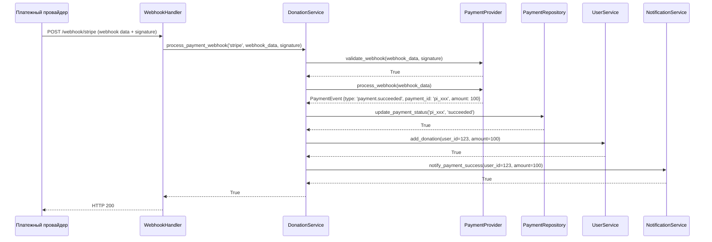
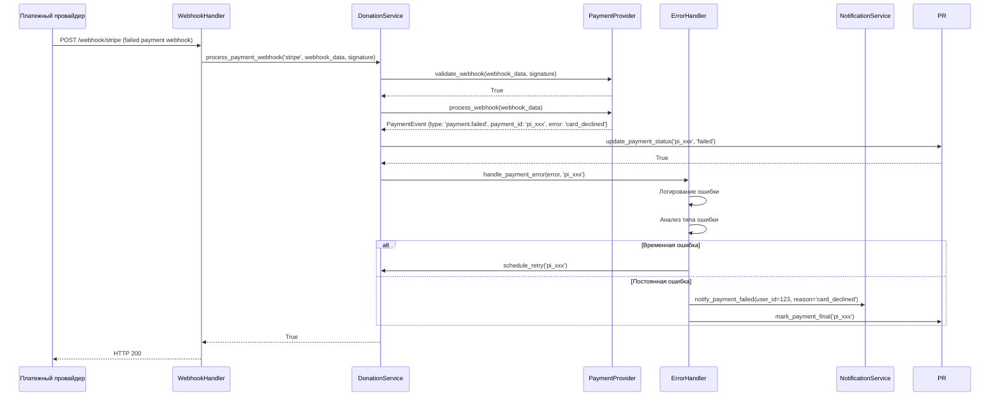

# 🏗 Архитектура Donation Service

## Обзор

Donation Service - это полноценная система обработки платежей с интеграцией нескольких платежных провайдеров (Stripe, YooKassa), обеспечивающая безопасную и надежную обработку донатов от пользователей телеграм-бота.

## 🎯 Основные требования

- **Интеграция платежных систем**: Stripe и YooKassa
- **Обработка платежей**: Создание, валидация, обработка транзакций
- **Безопасность**: Защита от фрода, валидация webhook подписей
- **Надежность**: Обработка ошибок, retry логика, транзакции
- **Уведомления**: Оповещения пользователей о статусе платежей
- **Мониторинг**: Метрики и логирование платежных операций

## 🏛 Архитектурная диаграмма

```mermaid
graph TB
    subgraph "Использование"
        User[Пользователь]
        Bot[Телеграм Бот]
        Webhook[Webhook Handler]
    end

    subgraph "Сервисы"
        DS[DonationService]
        PP[PaymentProvider<br/>Interface]
        NS[NotificationService]
    end

    subgraph "Провайдеры"
        SP[StripePaymentProvider]
        YP[YooKassaPaymentProvider]
    end

    subgraph "Репозитории"
        PR[PaymentRepository]
        UR[UserRepository]
    end

    subgraph "Внешние системы"
        Stripe[(Stripe API)]
        YooKassa[(YooKassa API)]
    end

    User --> Bot
    Bot --> DS
    DS --> PP
### Диаграммы последовательности

#### Процесс создания платежа

```mermaid
sequenceDiagram
    participant U as Пользователь
    participant B as Телеграм Бот
    participant DS as DonationService
    participant PP as PaymentProvider
    participant PR as PaymentRepository
    participant Ext as Внешний API

    U->>B: Команда /donate 100
    B->>DS: create_donation(user_id=123, amount=100, provider='stripe')

    DS->>DS: Валидация данных
    DS->>PP: create_payment(amount=100, currency='RUB', user_id=123, metadata={})

    PP->>Ext: API вызов create payment
    Ext-->>PP: PaymentIntent {id: 'pi_xxx', url: 'https://...'}
    PP-->>DS: PaymentIntent

    DS->>PR: create_payment({user_id: 123, amount: 100, external_id: 'pi_xxx', status: 'pending'})
    PR-->>DS: Payment record {id: 456}

    DS-->>B: DonationResponse {payment_url: 'https://...', payment_id: 456}
    B-->>U: Инлайн клавиатура с ссылкой на оплату
```

#### Процесс обработки webhook



#### Процесс обработки ошибок платежа



## 🔧 Детальная архитектура
    PP --> SP
    PP --> YP
    SP --> Stripe
    YP --> YooKassa

    Webhook --> DS

    DS --> PR
    DS --> UR
    DS --> NS
```

## 🔧 Компоненты системы

### 1. PaymentProvider (Абстрактный интерфейс)

```python
class PaymentProvider(ABC):
    """Абстрактный интерфейс для платежных провайдеров"""

    @abstractmethod
    def create_payment(self, amount: float, currency: str, user_id: int, metadata: Dict) -> PaymentIntent:
        """Создание платежа"""
        pass

    @abstractmethod
    def confirm_payment(self, payment_id: str) -> bool:
        """Подтверждение платежа"""
        pass

    @abstractmethod
    def cancel_payment(self, payment_id: str) -> bool:
        """Отмена платежа"""
        pass

    @abstractmethod
    def get_payment_status(self, payment_id: str) -> PaymentStatus:
        """Получение статуса платежа"""
        pass

    @abstractmethod
    def validate_webhook(self, request_data: Dict, signature: str) -> bool:
        """Валидация webhook подписи"""
        pass

    @abstractmethod
    def process_webhook(self, webhook_data: Dict) -> PaymentEvent:
        """Обработка webhook события"""
        pass
```

### 2. DonationService (Основной сервис)

```python
class DonationService:
    """Основной сервис для обработки донатов"""

    def __init__(self, payment_repo: PaymentRepository, user_service: UserService,
                 notification_service: NotificationService):
        self.payment_repo = payment_repo
        self.user_service = user_service
        self.notification_service = notification_service
        self.providers = {}  # Словарь провайдеров

    def create_donation(self, user_id: int, amount: float, provider_name: str = 'stripe') -> DonationResponse:
        """Создание доната"""
        # Валидация входных данных
        self._validate_donation_data(user_id, amount, provider_name)

        # Получение провайдера
        provider = self._get_provider(provider_name)

        # Создание платежа через провайдера
        payment_intent = provider.create_payment(amount, 'RUB', user_id, {})

        # Сохранение платежа в БД
        payment_record = self.payment_repo.create_payment({
            'user_id': user_id,
            'amount': amount,
            'currency': 'RUB',
            'provider': provider_name,
            'external_id': payment_intent.id,
            'status': 'pending'
        })

        return DonationResponse(payment_url=payment_intent.url, payment_id=payment_record.id)

    def process_payment_webhook(self, provider_name: str, webhook_data: Dict, signature: str) -> bool:
        """Обработка webhook от платежного провайдера"""
        provider = self._get_provider(provider_name)

        # Валидация подписи
        if not provider.validate_webhook(webhook_data, signature):
            raise PaymentSecurityError("Invalid webhook signature")

        # Обработка события
        payment_event = provider.process_webhook(webhook_data)

        # Обновление статуса платежа
        self._handle_payment_event(payment_event)

        return True

    def _handle_payment_event(self, event: PaymentEvent):
        """Обработка события платежа"""
        if event.type == 'payment.succeeded':
            self._process_successful_payment(event.payment_id, event.amount)
        elif event.type == 'payment.failed':
            self._process_failed_payment(event.payment_id)
        elif event.type == 'payment.cancelled':
            self._process_cancelled_payment(event.payment_id)
```

### 3. Реализации провайдеров

#### StripePaymentProvider

```python
class StripePaymentProvider(PaymentProvider):
    """Интеграция с Stripe"""

    def __init__(self, api_key: str, webhook_secret: str):
        self.stripe.api_key = api_key
        self.webhook_secret = webhook_secret

    def create_payment(self, amount: float, currency: str, user_id: int, metadata: Dict) -> PaymentIntent:
        """Создание платежа в Stripe"""
        try:
            intent = stripe.PaymentIntent.create(
                amount=int(amount * 100),  # Stripe работает с копейками
                currency=currency.lower(),
                metadata={'user_id': str(user_id), **metadata},
                payment_method_types=['card'],
            )
            return PaymentIntent(id=intent.id, url=intent.client_secret)
        except stripe.error.StripeError as e:
            raise PaymentProviderError(f"Stripe error: {e}")

    def validate_webhook(self, request_data: Dict, signature: str) -> bool:
        """Валидация Stripe webhook подписи"""
        try:
            stripe.Webhook.construct_event(request_data, signature, self.webhook_secret)
            return True
        except ValueError:
            return False

    def process_webhook(self, webhook_data: Dict) -> PaymentEvent:
        """Обработка Stripe webhook"""
        event = webhook_data
        payment_intent = event.data.object

        return PaymentEvent(
            type=f"payment.{event.type.split('.')[1]}",
            payment_id=payment_intent.id,
            amount=payment_intent.amount / 100,
            currency=payment_intent.currency,
            metadata=payment_intent.metadata
        )
```

#### YooKassaPaymentProvider

```python
class YooKassaPaymentProvider(PaymentProvider):
    """Интеграция с YooKassa"""

    def __init__(self, shop_id: str, secret_key: str):
        self.client = Client(shop_id=shop_id, secret_key=secret_key)

    def create_payment(self, amount: float, currency: str, user_id: int, metadata: Dict) -> PaymentIntent:
        """Создание платежа в YooKassa"""
        payment = Payment.create({
            "amount": {
                "value": f"{amount:.2f}",
                "currency": currency
            },
            "metadata": {'user_id': str(user_id), **metadata},
            "confirmation": {
                "type": "redirect",
                "return_url": "https://t.me/bot"  # URL возврата
            },
            "capture": True
        }, self.client.id)

        return PaymentIntent(id=payment.id, url=payment.confirmation.confirmation_url)

    def validate_webhook(self, request_data: Dict, signature: str) -> bool:
        """Валидация YooKassa webhook"""
        # Реализация валидации подписи для YooKassa
        pass

    def process_webhook(self, webhook_data: Dict) -> PaymentEvent:
        """Обработка YooKassa webhook"""
        event = webhook_data
        payment = event.object

        return PaymentEvent(
            type=f"payment.{payment.status}",
            payment_id=payment.id,
            amount=float(payment.amount.value),
            currency=payment.amount.currency,
            metadata=payment.metadata or {}
        )
```

## 📊 Модели данных

### Payment (Платеж)

```python
@dataclass
class Payment:
    """Модель платежа"""
    id: int
    user_id: int
    amount: float
    currency: str
    provider: str  # 'stripe' или 'yookassa'
    external_id: str  # ID платежа у провайдера
    status: str  # pending, succeeded, failed, cancelled
    created_at: datetime
    updated_at: datetime
    processed_at: Optional[datetime] = None
    metadata: Optional[Dict] = None
```

### Transaction (Транзакция)

```python
@dataclass
class Transaction:
    """Модель транзакции"""
    id: int
    payment_id: int
    type: str  # payment, refund
    amount: float
    status: str
    external_transaction_id: Optional[str] = None
    created_at: datetime
    details: Optional[Dict] = None
```

## 🔐 Система безопасности

### Валидация webhook подписей

```python
class PaymentSecurity:
    """Безопасность платежных операций"""

    @staticmethod
    def validate_stripe_signature(payload: bytes, signature: str, secret: str) -> bool:
        """Валидация подписи Stripe"""
        try:
            stripe.Webhook.construct_event(payload, signature, secret)
            return True
        except ValueError:
            return False

    @staticmethod
    def validate_yookassa_signature(request_body: str, signature: str, secret: str) -> bool:
        """Валидация подписи YooKassa"""
        # Реализация алгоритма HMAC-SHA256
        pass

    @staticmethod
    def prevent_double_processing(payment_id: str, idempotency_key: str) -> bool:
        """Предотвращение двойной обработки"""
        # Проверка в Redis/cache
        pass
```

## 📋 Схема базы данных

```sql
-- Таблица платежей
CREATE TABLE payments (
    id INTEGER PRIMARY KEY AUTOINCREMENT,
    user_id INTEGER NOT NULL,
    amount REAL NOT NULL,
    currency TEXT DEFAULT 'RUB',
    provider TEXT NOT NULL, -- 'stripe' или 'yookassa'
    external_id TEXT UNIQUE NOT NULL,
    status TEXT DEFAULT 'pending',
    created_at DATETIME DEFAULT CURRENT_TIMESTAMP,
    updated_at DATETIME DEFAULT CURRENT_TIMESTAMP,
    processed_at DATETIME,
    metadata TEXT, -- JSON
    FOREIGN KEY (user_id) REFERENCES users(id)
);

-- Таблица транзакций
CREATE TABLE transactions (
    id INTEGER PRIMARY KEY AUTOINCREMENT,
    payment_id INTEGER NOT NULL,
    type TEXT NOT NULL, -- 'payment', 'refund'
    amount REAL NOT NULL,
    status TEXT NOT NULL,
    external_transaction_id TEXT,
    created_at DATETIME DEFAULT CURRENT_TIMESTAMP,
    details TEXT, -- JSON
    FOREIGN KEY (payment_id) REFERENCES payments(id)
);

-- Индексы для производительности
CREATE INDEX idx_payments_user_id ON payments(user_id);
CREATE INDEX idx_payments_external_id ON payments(external_id);
CREATE INDEX idx_payments_status ON payments(status);
CREATE INDEX idx_transactions_payment_id ON transactions(payment_id);
```

## 🔄 Обработка ошибок

### Иерархия исключений

```
PaymentError (базовое)
├── PaymentProviderError     # Ошибки провайдера
├── PaymentValidationError   # Ошибки валидации
├── PaymentSecurityError     # Ошибки безопасности
├── PaymentTimeoutError      # Таймауты
└── PaymentDuplicateError    # Дубликаты платежей
```

### Стратегия обработки ошибок

```python
class PaymentErrorHandler:
    """Обработчик ошибок платежей"""

    def handle_payment_error(self, error: PaymentError, payment_id: str):
        """Обработка ошибки платежа"""
        # Логирование ошибки
        logger.error(f"Payment error for {payment_id}: {error}")

        # Определение стратегии retry
        if isinstance(error, PaymentTimeoutError):
            self._schedule_retry(payment_id)
        elif isinstance(error, PaymentSecurityError):
            self._notify_security_team(payment_id)
        else:
            self._mark_payment_failed(payment_id)

    def _schedule_retry(self, payment_id: str):
        """Планирование повторной попытки"""
        # Добавление в очередь retry
        pass

    def _notify_security_team(self, payment_id: str):
        """Уведомление команды безопасности"""
        pass
```

## 📡 Система уведомлений

### NotificationService

```python
class NotificationService:
    """Сервис уведомлений"""

    async def notify_payment_success(self, user_id: int, amount: float):
        """Уведомление об успешном платеже"""
        message = f"✅ Спасибо за донат {amount} ₽! Ваши средства зачислены."
        await self.bot.send_message(chat_id=user_id, text=message)

    async def notify_payment_failed(self, user_id: int, reason: str):
        """Уведомление о неудачном платеже"""
        message = f"❌ К сожалению, платеж не прошел. Причина: {reason}"
        await self.bot.send_message(chat_id=user_id, text=message)

    async def notify_admin_payment_issue(self, payment_id: str, error: str):
        """Уведомление админов о проблеме с платежом"""
        # Отправка в админ-чат
        pass
```

## ⚙️ Конфигурация

### Пример конфигурации

```python
PAYMENT_CONFIG = {
    'providers': {
        'stripe': {
            'enabled': True,
            'api_key': os.getenv('STRIPE_API_KEY'),
            'webhook_secret': os.getenv('STRIPE_WEBHOOK_SECRET'),
            'currency': 'RUB'
        },
        'yookassa': {
            'enabled': True,
            'shop_id': os.getenv('YOOKASSA_SHOP_ID'),
            'secret_key': os.getenv('YOOKASSA_SECRET_KEY'),
            'currency': 'RUB'
        }
    },
    'validation': {
        'min_amount': 10.0,
        'max_amount': 10000.0,
        'allowed_currencies': ['RUB', 'USD', 'EUR']
    },
    'retry': {
        'max_attempts': 3,
        'delay_seconds': 60
    },
    'webhook': {
        'timeout': 30,
        'max_retries': 5
    }
}
```

## 📈 Метрики и мониторинг

### Ключевые метрики

- **Объем платежей**: Общая сумма, количество транзакций
- **Конверсия**: Доля успешных платежей
- **Время обработки**: Среднее время от создания до завершения
- **Ошибки**: Количество и типы ошибок по провайдерам
- **Безопасность**: Попытки фрода, валидные/невалидные webhook

### Инструменты мониторинга

```python
class PaymentMetrics:
    """Метрики платежей"""

    def record_payment_created(self, amount: float, provider: str):
        """Запись метрики создания платежа"""
        # Prometheus counter
        pass

    def record_payment_completed(self, amount: float, duration: float):
        """Запись метрики завершенного платежа"""
        # Prometheus histogram
        pass

    def record_payment_failed(self, error_type: str):
        """Запись метрики неудачного платежа"""
        # Prometheus counter
        pass
```

## 🧪 Тестирование

### Unit тесты

- **PaymentProvider**: Мокирование API вызовов
- **DonationService**: Тестирование бизнес-логики
- **Валидация**: Тестирование всех сценариев
- **Обработка ошибок**: Тестирование исключений

### Integration тесты

- **Полный цикл платежа**: От создания до обработки webhook
- **Взаимодействие с БД**: Тестирование репозиториев
- **Внешние API**: Тестирование с тестовыми аккаунтами

### Test doubles

```python
class MockPaymentProvider(PaymentProvider):
    """Мок провайдера для тестирования"""

    def __init__(self, responses: Dict = None):
        self.responses = responses or {}
        self.calls = []

    def create_payment(self, amount: float, currency: str, user_id: int, metadata: Dict):
        self.calls.append(('create_payment', amount, currency, user_id, metadata))
        return self.responses.get('create_payment', PaymentIntent('mock_id', 'mock_url'))
```

## 🚀 Развертывание и эксплуатация

### Процесс развертывания

1. **Настройка провайдеров**: Регистрация аккаунтов, получение API ключей
2. **Конфигурация webhook**: Настройка URL для получения уведомлений
3. **Миграции БД**: Применение схемы платежей
4. **Тестирование**: Интеграционное тестирование с тестовыми платежами
5. **Мониторинг**: Настройка алертов и дашбордов

### Мониторинг в эксплуатации

- **Health checks**: Проверка доступности API провайдеров
- **Alerting**: Уведомления при проблемах с платежами
- **Логирование**: Детальное логирование всех операций
- **Backup**: Резервное копирование данных платежей

---

*Архитектура разработана для обеспечения надежной, безопасной и масштабируемой обработки платежей в телеграм-боте.*