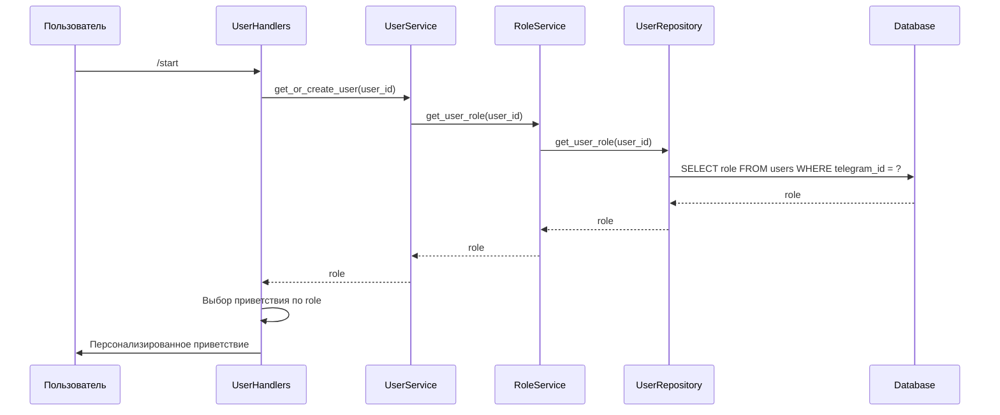

# 🏗 План реализации системы разделения приветствий по ролям

## Обзор

Реализация системы персонализированных приветствий для разных категорий пользователей (обычные пользователи, модераторы, администраторы) в Telegram боте.

## 🎯 Цели

- Персонализация приветствий на основе ролей пользователей
- Обеспечение обратной совместимости с существующими пользователями
- Безопасность и валидация ролей
- Масштабируемость для будущих ролей

## 📋 Компоненты системы

### 1. Модель данных (Database Layer)
- **User модель**: Добавить поле `role` типа `str` с default `'user'`
- **Миграция БД**: ALTER TABLE users ADD COLUMN role TEXT DEFAULT 'user'
- **UserRepository**: Методы для работы с ролями пользователей

### 2. Бизнес-логика (Services Layer)
- **RoleService**: Управление ролями пользователей
  - `assign_role(user_id: int, role: str) -> bool`
  - `get_user_role(user_id: int) -> str`
  - `validate_role(role: str) -> bool`
  - `is_admin(user_id: int) -> bool`
  - `is_moderator(user_id: int) -> bool`
- **UserService**: Интеграция с RoleService

### 3. Презентационный слой (Handlers Layer)
- **messages.py**: Словарь `greetings_by_role` с приветствиями по ролям
- **UserHandlers._handle_start**: Выбор приветствия на основе роли

### 4. Валидация и безопасность
- Допустимые роли: 'user', 'moderator', 'admin'
- Fallback на 'user' для неизвестных ролей
- Защита от изменения ролей обычными пользователями

## 🔄 Поток работы



## 📁 Структура изменений

```
telegram_bot/
├── database/
│   ├── models.py              # + поле role в User
│   └── repository.py          # + методы для ролей
├── services/
│   ├── user_service.py        # обновление
│   └── role_service.py        # НОВЫЙ
├── handlers/
│   └── user_handlers.py       # модификация _handle_start
├── messages.py                # + greetings_by_role
└── database_migration.sql     # НОВЫЙ: миграция БД
```

## 📋 План реализации (пошагово)

### Этап 1: Подготовка данных
1. ✅ Анализ существующей архитектуры
2. 🔄 Обновить модель User (добавить поле role)
3. 🔄 Создать миграцию базы данных
4. 🔄 Добавить приветствия по ролям в messages.py

### Этап 2: Бизнес-логика
5. 🔄 Создать RoleService
6. 🔄 Обновить UserService для работы с ролями
7. 🔄 Обновить UserRepository

### Этап 3: Обработчики и валидация
8. 🔄 Модифицировать обработчик /start
9. 🔄 Добавить логику проверки ролей
10. 🔄 Добавить валидацию ролей

### Этап 4: Тестирование
11. 🔄 Протестировать систему приветствий для разных ролей

## 🔧 Технические детали

### Модель User (database/models.py)
```python
@dataclass
class User:
    # ... существующие поля ...
    role: str = "user"  # НОВОЕ ПОЛЕ
```

### Миграция БД
```sql
ALTER TABLE users ADD COLUMN role TEXT DEFAULT 'user';
```

### Приветствия по ролям (messages.py)
```python
'greetings_by_role': {
    'user': '''Привет, {name}! 👋
Добро пожаловать в чат. Я ваш помощник здесь.
Используйте /help для подробной информации.''',

    'moderator': '''Привет, {name}! 👋
Как модератор, вы можете управлять чатом.
Используйте /help для команд модерации.''',

    'admin': '''Привет, {name}! 👋
Добро пожаловать, администратор. У вас полный доступ к управлению ботом.
Начните с /help для списка команд.'''
}
```

### RoleService (services/role_service.py)
```python
class RoleService:
    VALID_ROLES = {'user', 'moderator', 'admin'}

    def get_user_role(self, user_id: int) -> str:
        # Получение роли из БД

    def assign_role(self, user_id: int, role: str) -> bool:
        # Назначение роли с валидацией

    def validate_role(self, role: str) -> bool:
        return role in self.VALID_ROLES

    def is_admin(self, user_id: int) -> bool:
        return self.get_user_role(user_id) == 'admin'

    def is_moderator(self, user_id: int) -> bool:
        role = self.get_user_role(user_id)
        return role in {'moderator', 'admin'}
```

## ✅ Критерии успеха

- ✅ Новые пользователи получают роль 'user' и соответствующее приветствие
- ✅ Администраторы получают расширенное приветствие
- ✅ Модераторы получают приветствие с информацией о правах
- ✅ Fallback работает для неизвестных ролей
- ✅ Обратная совместимость с существующими пользователями
- ✅ Безопасность: только админы могут менять роли

## 🚀 Следующие шаги

После утверждения плана:
1. Переключиться в режим code для реализации
2. Начать с обновления модели User
3. Последовательно реализовать все компоненты
4. Протестировать на всех ролях

---
*Создано: 27 октября 2025 г.*
*Статус: Готово к реализации*